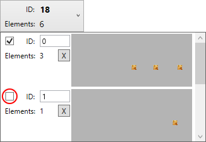
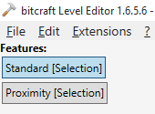
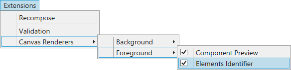

# Level Editor

## Overview

The Level Editor is a graphical tool to create level design data.

## Key bindings

### File key bindings

Key binding | Description
:--- | :---
`Ctrl + N` | Closes the current file, if any open, and cleans the space for a new file.
`Ctrl + O` | Opens a dialog box to load a file.
`Ctrl + S` | Saves the current file. It may open a dialog box if the file is a new one and have never been saved.
`Ctrl + Shift + S` | Opens a dialog box to save the current file to a new location and/or filename.
`Ctrl + W` | Closes the Level Editor application.

### Edition key bindings

The description of key bindings bellow are applicable when working with the game board only. They may have different behaviour when the focus is given to another part of the application.

Key binding | Description
:--- | :---
`Ctrl + X` | Deletes the currently selected block elements and copy them to the clipboard.
`Ctrl + C` | Copies the currently selected block elements to the clipboard.
`Ctrl + V` | Pastes the copied block elements to the game board.

**Note:** the data copied to the clipboard is not persistent and is cleared when the Level Editor exits.

Key binding | Description
:--- | :---
`Ctrl + A` | Selects all the block elements.
`Ctrl + D` | Unselects all the block elements.
`Ctrl + I` | Invert the block elements selection.

Key binding | Description
:--- | :---
`Ctrl + Shift + A` | Enables all blocks of the file.
`Ctrl + Shift + D` | Disables all blocks of the file.

The screen shot bellow shows where is the block enabling / disabling.

Key binding | Description
:--- | :---
`Ctrl + G` | Generate a GUID and copies it to the clipboard.

### Tools key bindings

Key binding | Description
:--- | :---
`S` | Switches the selection tools.

Tools are the features located between the menu and the components toolbox.

### Translation key bindings

Press the `Up`, `Down` `Right` or `Left` arrow keys to move the selected block element, using grid snapping.

Press the `X` key to snap movement of the block element along the X axis, use `Y` to do the same along the Y axis.

For any of those keys, you can combine with the `Shift` key to move the selected block element pixel per pixel.

### Rotation key bindings

When rotating one or several block elements, you can press the `Shift` key snap angle to 15 degrees.

You can also press the `Ctrl` key to make all the selected block element rotate to the same angle. 

### Navigation key bindings

Key binding | Description
:--- | :---
`Ctrl + ,` | Selects the previous block.
`Ctrl + .` | Selects the next block.

### Extensions

#### Element Identifier extension key bindings

If the `Element Identifier` is available and active as on the image bellow

then hereafter are the available key bindings:

Key binding | Description
:--- | :---
`Ctrl + E` | Toggle the block element identifiers on and off
 